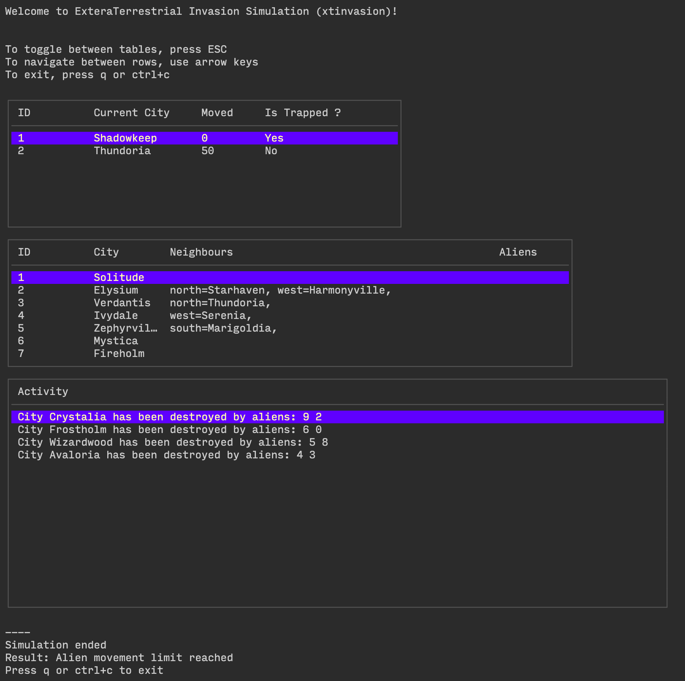

# Extra Terrestrial Invasion Simulation

## How to run
To run the program, follow these steps:

1. Clone the repository
```
$ git clone https://github.com/derrandz/xtinvasion.git
```

2. Build the program
```
$ make build
```

3. Run tests
```
$ make test
```

4. Run the program

Run the program with the start command and provide the desired flags:
```
$ make start aliens=50 input=data/map.txt output=output/map.txt log=output/stdout.log
```

This will start the simulation with the specified aliens number using the specified map input file.
Adjust the --aliens and --file flags as needed to customize the simulation.

To see all available flags, run:
```
$ make start-help
```

5. Browse the pkg documentation
Run:
```
$ make godoc
```

and open the following link in your browser: http://localhost:6060/pkg/github.com/derrandz/xtinvasion/pkg/

### Bonus

To run a terminal UI version to watch the simulation in action, run:
```
$ make start-tui aliens=50 input=data/map.txt output=output/map.txt log=output/stdout.log delay_ms=40 max_moves=400
```
_Reduce max_moves to avoid waiting too long for the simulation to finish. You can also control the delay_ms which slows down the simulation to your preferences_

The terminal UI should look as follows:



## Design

The app is designed to simulate an alien invasion on a world map with cities and aliens. Here's a summary of the key design choices made to build this app:

1. Data Structures: The app uses two main data structures - City and Alien. The City struct represents a city and its neighbors, while the Alien struct represents an alien with an ID and the number of moves it has made. The world map is represented using a Map struct, containing a map of city names to pointers of City.

2. Graph-based Map: The world map is designed as a graph, where each city is connected to its neighboring cities through directions (north, south, east, west). This allows for efficient navigation between cities.

3. CLI: The app is transformed into a CLI program using the github.com/spf13/cobra and github.com/spf13/pflag packages. The main command is "start," which runs the invasion simulation.

4. CQRS Pattern: The app implements the Command-Query Responsibility Segregation (CQRS) pattern. The state controller methods handle different actions like destroying aliens, cities, and moving aliens.

5. App Struct: The App struct acts as the core component, holding the world map, aliens, and other necessary data. It also provides methods to initialize, run, print state, and stop the simulation.

6. Error Handling: Error handling is done using Go's idiomatic approach, returning errors when necessary, and handling them appropriately.

7. File I/O: The app's io controller can read the world map from a file and write the map state to a file using the io/ioutil package.

8. Testability: The app and controllers are designed with testability in mind. Various functions and methods are unit testable, ensuring code reliability and correctness.

9. Logging: The app's logger allows to switch between stdout and file logging.

10. Configurability: The app's config struct allows to configure the simulation parameters like the number of aliens, input file, output file, and log file. These parameters are configurable via CLI flags.

11. Documentation: The app is documented using Go's standard documentation format. The documentation can be viewed using the godoc command.
    
12. Table Output: The github.com/olekukonko/tablewriter package is used to display remaining cities and aliens in a neat tabular format.

Overall, the app is designed with modularity, clean architecture, and testability in mind. It follows best practices and patterns to create a well-structured, efficient, and maintainable codebase.

## Assumptions

- if map file has invalid lines, the program will exit with an error message
- if a city in the map has a non-existent neighbor, the program will exit with an error message 
- the simulation may start with more than one alien in a given city, the assigment of aliens to cities is random
- if all remaining aliens in the world map are trapped and there is no way they would meet, the simulation will end

